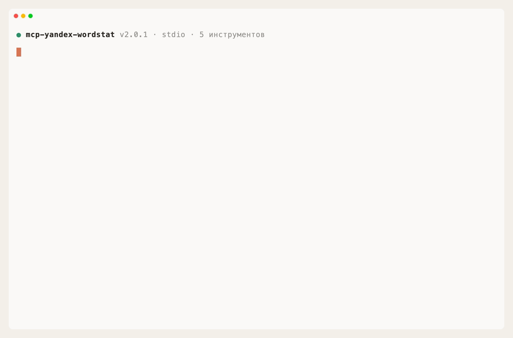

# Яндекс Вордстат MCP

[](https://www.npmjs.com/package/mcp-yandex-wordstat)
[](https://github.com/askads/mcp-yandex-wordstat/actions/workflows/ci.yml)
[](https://glama.ai/mcp/servers/askads/mcp-yandex-wordstat)
[](./LICENSE)

**Яндекс Вордстат MCP** подключает AI-приложение к статистике поискового спроса Яндекса. Спросите, как часто ищут фразу, в какие месяцы интерес растёт и в каких городах тема популярнее, — ассистент соберёт данные Вордстата и объяснит результат. Сервер работает через Yandex Cloud Search API, поэтому не требует доступа к рекламному кабинету Директа.

- **Пять инструментов.** Топ и похожие запросы, динамика спроса, распределение по регионам, справочник регионов и технический запрос к API.
- **Только чтение.** API Вордстата не создаёт кампании, объявления, ключевые фразы и другие объекты.
- **Спрос и сезонность.** Топ запросов и регионы показывают последние 30 дней; динамика строится по дням, неделям или месяцам за нужный период.
- **Регион и устройство.** Отчёты можно сузить до региона и сравнить спрос на компьютерах, телефонах и планшетах.
- **Без OAuth Директа.** Нужны API-ключ и ID каталога Yandex Cloud для Search API.

Начните с безопасного запроса:

> Сколько в месяц ищут «купить велосипед» и какие есть похожие запросы?

[Подключить сервер](#быстрый-старт) · [Посмотреть сценарии](#что-можно-поручить) · [Открыть техническую документацию](#техническая-документация)

---

## Увидеть работу за минуту



## Содержание

- [Быстрый старт](#быстрый-старт)
- [Что можно поручить](#что-можно-поручить)
- [Как читать данные спроса](#как-читать-данные-спроса)
- [Как получить доступ](#как-получить-доступ)
- [Что может изменить данные](#что-может-изменить-данные)
- [Данные, лимиты и работа в фоне](#данные-лимиты-и-работа-в-фоне)
- [Техническая документация](#техническая-документация)
- [Поддержка](#поддержка)

## Быстрый старт

Нужны Node.js 20 или новее, API-ключ Yandex Cloud для Search API и ID каталога Yandex Cloud.

1. [Получите доступ](#как-получить-доступ) и добавьте сервер в AI-приложение — инструкции для пяти приложений ниже.
2. Спросите: «Сколько в месяц ищут „купить велосипед“ и какие есть похожие запросы?»

<details open>
<summary><strong>Codex</strong></summary>

<br>

**Через интерфейс приложения:**

1. Откройте **Settings → Plugins → MCP servers**.
2. Нажмите **Add server**.
3. Добавьте команду запуска `npx -y mcp-yandex-wordstat@latest` и переменные окружения `WORDSTAT_API_KEY`, `WORDSTAT_FOLDER_ID`.

**Через командную строку:**

```bash
codex mcp add yandex-wordstat \
  --env WORDSTAT_API_KEY=ваш_ключ \
  --env WORDSTAT_FOLDER_ID=ваш_folder_id \
  -- npx -y mcp-yandex-wordstat@latest
```

Проверьте подключение:

```bash
codex mcp list
```

[Официальная инструкция Codex](https://learn.chatgpt.com/docs/extend/mcp?surface=cli)

</details>

<details>
<summary><strong>Claude Code</strong></summary>

<br>

```bash
claude mcp add \
  --env WORDSTAT_API_KEY=ваш_ключ \
  --env WORDSTAT_FOLDER_ID=ваш_folder_id \
  --transport stdio \
  --scope user \
  yandex-wordstat \
  -- npx -y mcp-yandex-wordstat@latest
```

Проверьте сервер:

```bash
claude mcp list
```

[Документация Claude Code](https://docs.anthropic.com/en/docs/claude-code/mcp)

</details>

<details>
<summary><strong>Claude Desktop</strong></summary>

<br>

Откройте **Settings → Developer → Edit Config** и добавьте сервер в `claude_desktop_config.json`:

```json
{
  "mcpServers": {
    "yandex-wordstat": {
      "command": "npx",
      "args": ["-y", "mcp-yandex-wordstat@latest"],
      "env": {
        "WORDSTAT_API_KEY": "ваш_ключ",
        "WORDSTAT_FOLDER_ID": "ваш_folder_id"
      }
    }
  }
}
```

Если **Edit Config** недоступна, отредактируйте `~/Library/Application Support/Claude/claude_desktop_config.json` на macOS или `%APPDATA%\Claude\claude_desktop_config.json` на Windows.

</details>

<details>
<summary><strong>Cursor</strong></summary>

<br>

Для всех проектов создайте `~/.cursor/mcp.json`; только для текущего проекта — `.cursor/mcp.json`:

```json
{
  "mcpServers": {
    "yandex-wordstat": {
      "command": "npx",
      "args": ["-y", "mcp-yandex-wordstat@latest"],
      "env": {
        "WORDSTAT_API_KEY": "ваш_ключ",
        "WORDSTAT_FOLDER_ID": "ваш_folder_id"
      }
    }
  }
}
```

[Документация Cursor](https://docs.cursor.com/context/model-context-protocol)

</details>

<details>
<summary><strong>VS Code</strong></summary>

<br>

Откройте палитру команд и выполните **MCP: Open User Configuration**. Добавьте в `mcp.json`:

```json
{
  "servers": {
    "yandex-wordstat": {
      "type": "stdio",
      "command": "npx",
      "args": ["-y", "mcp-yandex-wordstat@latest"],
      "env": {
        "WORDSTAT_API_KEY": "${input:wordstat_api_key}",
        "WORDSTAT_FOLDER_ID": "${input:wordstat_folder_id}"
      }
    }
  },
  "inputs": [
    {
      "type": "promptString",
      "id": "wordstat_api_key",
      "description": "API-ключ Yandex Cloud",
      "password": true
    },
    {
      "type": "promptString",
      "id": "wordstat_folder_id",
      "description": "ID каталога Yandex Cloud"
    }
  ]
}
```

Проверьте запуск командой **MCP: List Servers**.

[Документация VS Code](https://code.visualstudio.com/docs/agent-customization/mcp-servers)

</details>

## Что можно поручить

### Подобрать и оценить спрос

- «Сколько раз за месяц ищут эту фразу и какие похожие запросы встречаются?»
- «Подбери запросы вокруг „доставка пиццы“ с их частотностью».
- «Покажи запросы, содержащие мою фразу, отдельно от семантически похожих».

### Понять сезонность

- «Покажи спрос на „лыжи“ по месяцам за год».
- «В какие недели спрос на эту услугу растёт или падает?»
- «Сравни динамику запроса на телефонах и компьютерах».

### Сравнить регионы

- «В каких городах интерес к „ремонту квартир“ выше среднего?»
- «Сравни спрос в Москве и Санкт-Петербурге».
- «Найди ID нужного региона и сузь следующий отчёт до него».

## Как читать данные спроса

`top_requests` показывает популярные запросы, которые содержат заданную фразу, и семантически близкие запросы. Общий `totalCount` относится к последним 30 дням.

`dynamics` возвращает ряд `{date, count, share}` с дневной, недельной или месячной детализацией. `regions` распределяет спрос за последние 30 дней по регионам, а `affinityIndex` выше 100% означает интерес выше среднего. Значения счётчиков могут приходить строками: Яндекс передаёт большие целые числа в JSON в таком виде.

Один вызов строит данные только для одной фразы. Для большого списка ключевых слов лучше сначала сузить список, а не запускать все запросы подряд: квота Yandex Cloud Search API общая для одного ключа.

## Как получить доступ

1. В Yandex Cloud создайте сервисный аккаунт с ролью `search-api.webSearch.user`.
2. Выпустите для него API-ключ со scope `yc.search-api.execute` — шаги описаны в [документации AI Studio](https://yandex.cloud/ru/docs/ai-studio/operations/get-api-key).
3. Найдите ID каталога (`folderId`) в [консоли Yandex Cloud](https://console.yandex.cloud/) на странице каталога и в URL страницы.
4. Передайте ключ как `WORDSTAT_API_KEY`, а каталог как `WORDSTAT_FOLDER_ID`.

Сервер обращается к Yandex Cloud Search API v2. Старый отдельный Wordstat API с OAuth не используется. API-ключ хранится в конфигурации MCP-клиента открытым текстом — относитесь к нему как к паролю.

## Что может изменить данные

Ничего в Яндекс Вордстате. Все пять инструментов, включая `raw_request`, работают только на чтение. Технически API использует `POST`, но у Wordstat нет эндпоинтов на запись; сервер дополнительно не позволяет произвольному запросу уйти на другой хост.

## Данные, лимиты и работа в фоне

- **Агрегированные данные.** Сервер получает статистику поискового спроса, а не данные конкретного рекламного кабинета.
- **Кэш справочника регионов.** В долгоживущем процессе дерево регионов загружается один раз и переиспользуется в следующих запросах.
- **Повторы при временных ошибках.** Таймаут одного запроса — 60 секунд. Сервер делает до трёх повторов после `429`, `5xx`, сетевой ошибки или тайм-аута; учитывает `Retry-After`, а задержка не превышает 30 секунд.
- **Нет фонового наблюдения.** Сервер работает, когда его вызывает AI-приложение. Если приложение поддерживает задания по расписанию, в нём можно настроить периодический отчёт по выбранным фразам.
- **Анонимная телеметрия.** По умолчанию сервер отправляет случайный идентификатор установки, имя события или инструмента, версии сервера, Node.js, ОС и AI-клиента. В неё не попадают API-ключ, аргументы инструментов, ваши сообщения, данные спроса и значения переменных окружения. Отключить её для MCP-серверов Ask Ads: `ASKADS_TELEMETRY=0`.

## Техническая документация

- [Все инструменты и параметры](./docs/TOOLS.md)
- [Документация по разработке](./docs/DEVELOPMENT.md)
- [Документация по публикации](./docs/PUBLISHING.md)
- [Документация Yandex Cloud Search API](https://yandex.cloud/ru/docs/search-api/)

## Поддержка

Нашли ошибку или не хватает сценария? [Создайте issue](https://github.com/askads/mcp-yandex-wordstat/issues) или напишите в [Telegram](http://t.me/gistrec).
